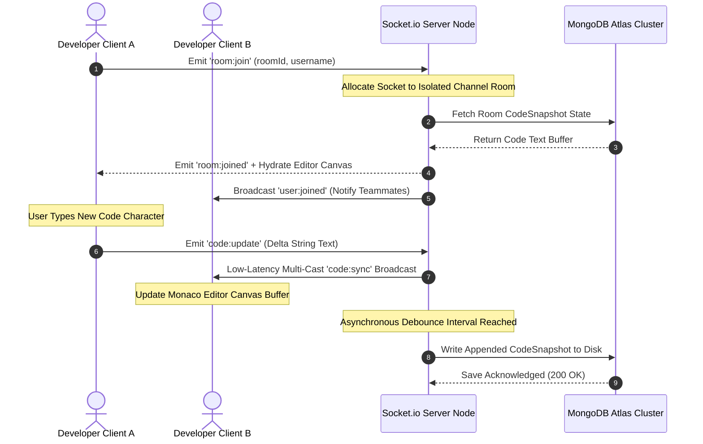
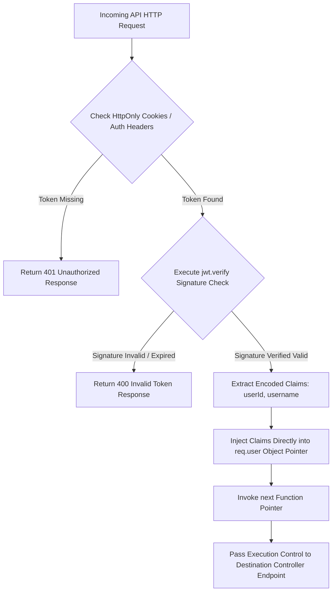
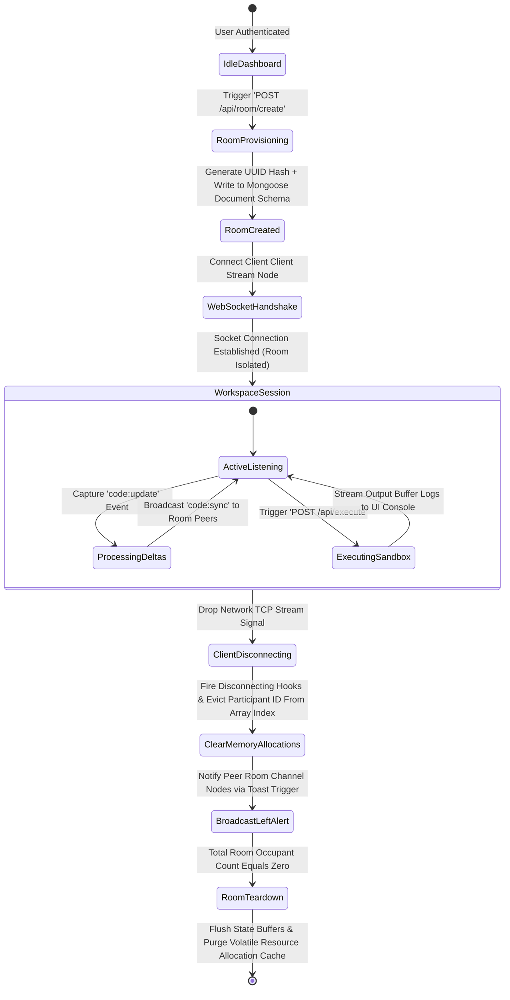

# ⚙️ CodeSync Backend Server Engine — MERN Architecture Documentation

This directory houses the foundational system engineering for the **CodeSync** platform. Built on the Node.js runtime framework utilizing the Express ecosystem, this subsystem orchestrates persistent bi-directional WebSockets, performs stateless authorization interceptor routines, enforces rigid document modeling structures, handles external isolation sandboxed code executions, and manages transactional email alerts.

---

## 🏗️ System Design & Architectural Patterns

The engine is architected using a decoupled, horizontal **Model-View-Controller (MVC)**-style service layout layer, tailored specifically for stateful real-time distributed application models:

* **Stateless REST Core:** Standard server CRUD actions (Authentication, Profile Queries, Room Provisioning Meta) are separated cleanly from real-time operational lines.
* **Persistent Event-Driven Pipelines:** Concurrent operational states (Keystroke transfers, active participant lists, live typing session arrays, instant room texting) route directly through long-lived persistent full-duplex TCP tunnels via **Socket.io**.
* **Third-Party Sandbox Infrastructure Abstraction:** Compilation payloads are dynamically isolated and decoupled from primary thread operations by passing execution streams to high-performance remote container sandboxes over strict network APIs.

---

## 📊 Structural Flowcharts & System Designs

### 1️⃣ WebSocket Real-Time Sync & Event Lifecycle
This sequence diagram shows how connection handshakes, live editor key deltas, and multi-cast room broadcasts behave under the hood without locking database threads:



### 2️⃣ Stateless Security Gatekeeper Interceptor Protocol

The flow of web request screening, header parsing, cryptographic token decoding, and pipeline execution routing:



### 3️⃣ Room Session State Transitions

The backend structural room creation lifecycle, validation paths, connection tolerances, and resource automatic cleanup states:



---

## 🗄️ Database Schemas & Mongoose Structural Modeling

The data storage framework utilizes **MongoDB Atlas** managed relational document clustering. We enforce deterministic entity types and lifecycle schemas on collection structures using **Mongoose ODM**.

### 1️⃣ User Entity Schema Collection (`models/User.js`)

Stores authentication properties, user identification keys, and structural metadata hooks.

```javascript
const mongoose = require('mongoose');

const userSchema = new mongoose.Schema({
  username: {
    type: String,
    required: [true, 'Unique username token identifier is mandatory'],
    unique: true,
    trim: true,
    minlength: [3, 'Username must contain a minimum of 3 characters']
  },
  email: {
    type: String,
    required: [true, 'Valid system contact email is mandatory'],
    unique: true,
    trim: true,
    lowercase: true,
    match: [/^\w+([\.-]?\w+)*@\w+([\.-]?\w+)*(\.\w{2,3})+$/, 'Please supply a structurally valid email string']
  },
  password: {
    type: String,
    required: [true, 'Cryptographic hash payload cannot be empty'],
    minlength: [6, 'Source passcode string must be at least 6 characters before salt transformations']
  },
  resetPasswordToken: {
    type: String,
    default: null
  },
  resetPasswordExpires: {
    type: Date,
    default: null
  },
  createdAt: {
    type: Date,
    default: Date.now
  }
});

module.exports = mongoose.model('User', userSchema);

```

### 2️⃣ Collaboration Room Entity Schema Collection (`models/Room.js`)

Manages the memory footprint, active state, password constraints, and dynamic tracking of active rooms.

```javascript
const mongoose = require('mongoose');

const roomSchema = new mongoose.Schema({
  roomId: {
    type: String,
    required: [true, 'Unique system generated room string hash is required'],
    unique: true,
    trim: true
  },
  codeSnapshot: {
    type: String,
    default: "" // Serves as the primary persistence string recovery block
  },
  activeLanguage: {
    type: String,
    enum: ['javascript', 'python', 'c', 'cpp', 'java'],
    default: 'javascript'
  },
  roomPassword: {
    type: String,
    default: null // Explicitly enabling optional secure private room sessions
  },
  participants: [{
    type: mongoose.Schema.Types.ObjectId,
    ref: 'User'
  }],
  maxParticipants: {
    type: Number,
    default: 10
  }
}, {
  timestamps: true // Dynamically injects and manages system createdAt and updatedAt flags
});

module.exports = mongoose.model('Room', roomSchema);

```

---

## 🔍 Comprehensive Module & Code Line-by-Line Mechanics

### 1️⃣ Application Bootstrapper & Routing Gateway (`server.js`)

This is the root initialization module. It sets up configuration contexts, binds network channels, and handles unhandled execution exceptions.

* **Line-by-Line Execution Breakdown:**
* Imports native core path tracking libraries (`path`, `http`) and links express frameworks.
* Invokes `dotenv.config()` to parse environment parameters straight into system application visibility fields (`process.env`).
* Triggers the data layer initialization routine exported from `config/db.js`.
* Initializes an instance of an Express application (`const app = express()`).
* Injects security interceptors: `cors()` controls external origins; `cookieParser()` enables extraction of verified browser authentication strings.
* Binds standard network parsing arrays: `express.json()` and `express.urlencoded()` to intercept structural JSON payloads without crashes.
* Mounts standard REST route controllers via path abstraction rules: `/api/auth` maps to standard user identity services; `/api/room` maps to operational space control blocks; `/api/execute` exposes cross-platform script testing.
* Wraps the configured `app` engine instance inside a native server framework via `http.createServer(app)`.
* Passes that running server reference object straight to the custom WebSocket orchestration layer (`socketHandler(server)`).
* Invokes `.listen(PORT)` to start serving application traffic across assigned cluster channels.


### 2️⃣ Stateless Security Gatekeeper Middlewares (`middleware/verifyToken.js`)

Protects secure internal cluster paths from unauthorized requests or data manipulation attempts.

```javascript
const jwt = require('jsonwebtoken');

module.exports = function (req, res, next) {
  // 1. Inspect incoming headers or cookie spaces for authorization keys
  const token = req.cookies.token || (req.header('Authorization') ? req.header('Authorization').split(' ')[1] : null);
  
  if (!token) {
    return res.status(401).json({ success: false, message: 'Access Denied: Missing system validation parameters' });
  }

  try {
    // 2. Perform synchronized cryptographic signature matching verification checks
    const verifiedPayload = jwt.verify(token, process.env.JWT_SECRET);
    
    // 3. Dynamically inject the user metadata model directly into the request processing lifecycle
    req.user = verifiedPayload;
    
    // 4. Safely release operational control to the next sequential execution controller handler
    next();
  } catch (err) {
    res.status(400).json({ success: false, message: 'Invalid token reference supplied' });
  }
};

```

### 3️⃣ Real-Time Engine Interface Broker (`socket/socketHandler.js`)

This module manages active persistent connections across multi-user synchronization rooms.

* **Line-by-Line Event Lifecycle Mechanics:**
* Initializes an `io` server router instance mounted onto the passed `http.Server` context, establishing global configurations for acceptable `cors` origins.
* Attaches a global connection listener loop: `io.on('connection', (socket) => { ... })`.
* **Room Setup (`room:join`):** Receives target payload models tracking metadata tokens (`roomId`, `username`). Invokes `socket.join(roomId)` to split incoming streams from the global socket multiplexer space into an isolated room network channel. It queries database contexts to update active structural indices and emits a `user:joined` event broadcast notification out to concurrent room occupants.
* **Synchronization Engine (`code:update`):** Captures key events and cursor alterations sent out by a developer typing in their environment. It bypasses persistence write lag models to immediately run a selective multi-cast broadcast relay: `socket.to(roomId).emit('code:sync', codeText)`. This ensures low-latency, character-by-character synchronization across all connected team screens.
* **Chat Infrastructure (`chat:message`):** Listens for chat input lines, appends automated timestamps along with localized user structural details, and relays the payload to all concurrent session users via a targeted `room` emission hook.
* **Disconnect Protocols (`disconnecting`):** Triggers cleanup routines before the connection drops completely. It checks the active tracking index of the user, removes the disconnected participant array hooks from the active schema collections, notifies the remaining developers via a `user:left` toast trigger event, and clears memory allocations.


### 4️⃣ Remote Isolation Sandboxed Compiler Client Proxy (`services/executorService.js`)

Wraps third-party secure code execution microservices. It serializes computational instructions and handles formatting for custom stdin parameters across different runtimes.

```javascript
const axios = require('axios');

exports.executeCode = async (sourceCode, languageId, customInput) => {
  // 1. Establish deterministic script runtime version index mapping matrices matching JDoodle's execution specifications
  const languageMapping = {
    javascript: { lang: "nodejs", versionIndex: "4" },
    python:     { lang: "python3", versionIndex: "4" },
    c:          { lang: "c",       versionIndex: "5" },
    cpp:        { lang: "cpp",     versionIndex: "5" },
    java:       { lang: "java",    versionIndex: "4" }
  };

  const selectedTarget = languageMapping[languageId];
  
  // 2. Construct the standardized structural network JSON envelope request structure
  const compilationPayload = {
    clientId: process.env.JDOODLE_CLIENT_ID,
    clientSecret: process.env.JDOODLE_CLIENT_SECRET,
    script: sourceCode,
    stdin: customInput || "",
    language: selectedTarget.lang,
    versionIndex: selectedTarget.versionIndex
  };

  // 3. Execute the remote REST call to the secure compilation grid environment
  const response = await axios.post('[https://api.jdoodle.com/v1/execute](https://api.jdoodle.com/v1/execute)', compilationPayload);
  
  // 4. Return serialized program output blocks, standard error streams, and runtime resource metrics
  return {
    output: response.data.output,
    statusCode: response.data.statusCode,
    memoryOverhead: response.data.memory,
    cpuTimeCost: response.data.cpuTime
  };
};

```

---

## 📡 API Endpoints Core Specifications

### Identity & Access Controls Protocol (`/api/auth`)

* `POST /register` -> Creates a new user record. Encrypts strings via `bcryptjs.hash()` prior to persistence operations.
* `POST /login` -> Matches credentials via `bcryptjs.compare()`. Issues signed authorization tokens via `jwt.sign()` embedded within secure HttpOnly cookies.
* `POST /forgot-password` -> Generates unique reset hashes, updates database expiration parameters, and routes password recovery URLs using a transactional `Nodemailer` service layer.

### Session Lifecycle Management Protocol (`/api/room`)

* `POST /create` -> *Protected Endpoint*. Generates unique structural UUID hashes, creates new room collections in the database layer, and returns the room access token.
* `POST /join` -> *Protected Endpoint*. Validates room availability rules, checks access credentials if a room password is configured, and updates user location tracking indices.
* `GET /:id` -> *Protected Endpoint*. Pulls current snapshots of code structures, language modes, and active room participant arrays to populate late-joining client IDEs.

### Direct Sandboxed Execution Core Protocol (`/api/execute`)

* `POST /` -> *Protected Endpoint*. Captures the current active editor text, passes compilation blocks directly through the `executorService` subsystem, and returns standard program outputs (`stdout`/`stderr`).

---

## ⚡ Technical Security & Performance Hardening

* **Secure HttpOnly Enforcements:** Authentication tokens are stored inside browser memory models configuration spaces with explicit `httpOnly: true`, `secure: true`, and `sameSite: 'strict'` parameters to prevent malicious JavaScript token-snatching vectors (XSS protection).
* **Decoupled Multi-Channel Scaling:** Sockets use target-room structural allocations (`socket.to(roomId)`) instead of open global emissions, keeping network traffic lightweight and low-latency as the app grows.
* **Asynchronous Serialization Checkpoints:** Code snapshots are updated inside the primary database collection layers using asynchronous, debounced saving mechanisms. This prevents disk read/write lockups during high-velocity team development sessions.

---

## ☁️ Production Deployment Blueprint

The production server layer is fully optimized for cloud platform container environments (such as **Render**, **Railway**, or **AWS EC2**), combined with a managed global replica cluster on **MongoDB Atlas**.

### Detailed Cloud Provisioning Steps (e.g., via Railway or Render):

1. **Repository Setup:** Push the verified codebase to an online workspace repository.
2. **Environment Provisioning:** Instantiate a new web service tracking target platform dashboards, and link the repository.
3. **Root Target Routing:** Define the operational workspace path to point to the `Backend/` subdirectory. Use the server start script configuration value: `npm start`.
4. **Configuration Injection:** Populate the target environment variables panel with your secure credentials (`MONGO_URI`, `JWT_SECRET`, `JDOODLE_CLIENT_ID`, etc.).
5. **Build Deployment Lifecycle:** The cloud deployment runners build your environment isolated from your frontend assets. They pull precise runtime versions, execute `npm install`, mount your production environment setups, and expose standard public URLs.

```
🌐 Render Link:  [https://real-time-code-editor-as44.onrender.com/api](https://real-time-code-editor-as44.onrender.com/api)

```

---

## 🙌 Credits & Core References

* **Express.js Engine Framework:** Fast, unopinionated minimalist routing server platform for Node.js.
* **Socket.io Infrastructure:** Real-time bi-directional event orchestration architecture.
* **Mongoose ODM Engine:** Structural schema definition logic tracking document persistence flows.

```
🚀 CodeSync Backend Service Module — Built for scalable, secure, and low-latency real-time collaboration.

```