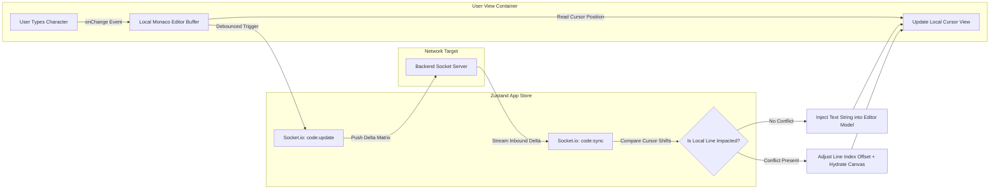
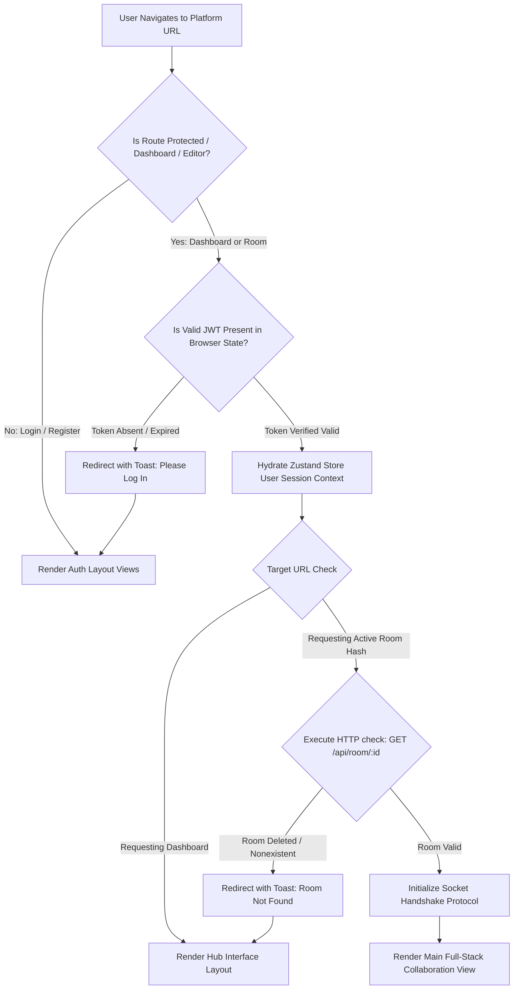

# 💻 CodeSync Frontend Client Engine — React & Zustand Architecture

This directory houses the user interface and reactive workspace engineering for the **CodeSync** platform. Built on the high-speed **Vite** build engine and powered by **React 18**, this layer coordinates a highly responsive full-stack developer environment. It manages state tracking via **Zustand**, captures live user input streams through an embedded **Monaco Editor**, establishes full-duplex WebSocket channels, and renders rich client-side animations.

---

## 📸 Application Interface & Live Preview

The live production deployment of the platform can be accessed at:
🌐 **Live URL:** [https://real-time-collaborative-code-editor-lime.vercel.app/](https://real-time-collaborative-code-editor-lime.vercel.app/)

---

### 🏠 Platform Landing Page
A modern, minimalist landing page that communicates the application's core value proposition, featuring an active operational status banner and direct entry vectors into secure programming rooms.

<p align="center">
  
</p>

---

### 🔐 Multi-Tenant Authentication & Core Workspace Control Hub
A secure dashboard architecture splitting access paths into isolated layout workflows: credentials checking on the left and dynamic collaboration-room lifecycle management panels on the right.

<p align="center">
  
  
</p>

* **Secure Account Provisioning:** User identification mapping, standard email formatting validation layers, and salted password transformations.
* **Granular Session Controls:** Provisions unique 6-digit room identifiers with customized lifecycle duration constraints (5–1440 minutes) and optional cryptographic session passwords.

---

### 💻 Live Real-Time Collaboration Workspace IDE
The primary high-velocity collaborative core workspace pane combining real-time document sync with integrated room communication systems.

<p align="center">
  
</p>

* **Full-Duplex Editor Buffer:** Embedded Monaco Editor tracking code variations instantly across multi-user environments with built-in language dropdown syntax definitions.
* **Presence & Workspace Management:** Displays current workspace connectivity states (`Connected`), active tracking metrics (`1/20 participants`), single-click dynamic token invite links, and native terminal standard-execution hooks (`Run`).
* **Sidebar Communication Rail:** Toggleable utilities allowing seamless switching between real-time team text channels (featuring emoji integration) and active participant list indexes.

---

## 🏗️ Core Frontend Architecture & UI Design Patterns

The frontend application follows a declarative component-driven architecture paired with centralized state slices to prevent heavy component re-renders:

* **Unidirectional Data Flow:** UI components emit user events to centralized state stores, which update reactive data states and automatically re-render the subscribed UI views.
* **Persistent Multiplex Client Channels:** Long-lived duplex event triggers route through **Socket.io-client** to ensure user typing is shared instantly without lagging the primary UI layout thread.
* **Granular Layout Segmentation:** The coding workspace is isolated cleanly into independent layout panes—Active Member Rails, Monaco Core Workspace, Messaging Timelines, and Runtime Output Consoles.

---

## 📊 Client-Side System Layouts & State Machines

### 1️⃣ Bi-Directional Workspace Editing Pipeline
This data-flow diagram models how user typing actions sync asynchronously over WebSocket threads, alongside incoming remote change streams adjusting the local text buffer:



### 2️⃣ Client Router Lifecycle & Navigation Guardrails

The layout management system evaluates security states, intercepts unauthenticated URL calls, and tracks private room routes:



### 3️⃣ Interface Grid Layout Specification

The desktop IDE interface maps screen real estate efficiently using a custom CSS grid system layout:

```text
+-----------------------------------------------------------------------------------------+
|                                  APPLICATION TOP NAVBAR                                 |
+-------------------+-------------------------------------------------+-------------------+
|                   |                                                 |                   |
|                   |             CENTRAL WORKSPACE                   |                   |
|  ACTIVE USERS     |             (Monaco Code Editor)                |    INTEGRATED     |
|  PRESENCE RAIL    |                                                 |     WORKSPACE     |
|                   |                                                 |     CHAT ROOM     |
|   (Avatar Stack)  |                                                 |                   |
|                   |                                                 |  (Emoji Pickers)  |
|                   +-------------------------------------------------+                   |
|                   |                                                 |                   |
|                   |             RUNTIME OUTPUT CONSOLE              |                   |
|                   |             (Stdout / Stderr Streams)           |                   |
+-------------------+-------------------------------------------------+-------------------+

```

---

## 🧩 Comprehensive Module & Component Mechanics

### 1️⃣ Application Root Bootstrapper & Client Router (`main.jsx` & `App.jsx`)

Coordinates global context initialization, DOM target mounting, and path definitions.

* **Line-by-Line Execution Breakdown:**
* **`main.jsx`:** Imports React DOM mounting drivers, links global stylesheet systems (`index.css`), and mounts the primary `<App />` root component tree inside the standard `div#root` DOM node.
* **`App.jsx`:** Instantiates a client-side layout router mapping path variations using a declarative route tree: `/login` and `/register` are accessible to public users; `/dashboard` and `/room/:roomId` are wrapped inside custom authorization wrapper elements.


### 2️⃣ Centralized Application State Manager (`store/useAppStore.js`)

Instead of nesting complex props down multiple layers, this module acts as a fast, single state engine powered by **Zustand**.

```javascript
import { create } from 'zustand';

export const useAppStore = create((set) => ({
  user: null,
  activeRoomId: null,
  activeParticipants: [],
  currentCodeBuffer: "",
  selectedLanguage: "javascript",
  isCompiling: false,
  consoleOutput: "",

  // Synchronized Actions updating individual state keys across the app
  setUserSession: (userData) => set({ user: userData }),
  clearUserSession: () => set({ user: null, activeRoomId: null, activeParticipants: [] }),
  setRoomConnection: (roomId) => set({ activeRoomId: roomId }),
  updateParticipantsList: (usersArray) => set({ activeParticipants: usersArray }),
  updateCodeState: (newText) => set({ currentCodeBuffer: newText }),
  setExecutionLanguage: (lang) => set({ selectedLanguage: lang }),
  
  triggerCompilationStart: () => set({ isCompiling: true, consoleOutput: "Compiling source dependencies..." }),
  setCompilationOutput: (outputLog) => set({ consoleOutput: outputLog, isCompiling: false })
}));

```

### 3️⃣ Collaborative Text Canvas Interface (`components/CodeEditor.jsx`)

Binds the enterprise-tier **Monaco Code Editor Engine** into the React runtime lifecycle, enabling smooth, bi-directional typing synchronization.

* **Line-by-Line Layout Mechanics:**
* Imports the official `@monaco-editor/react` package into the component scope.
* Sets up an explicit editor mounting observer: `handleEditorDidMount(editorInstance)`. This captures a reference to the low-level editor instance and saves it inside local component hooks.
* Implements an outbound input listener (`handleEditorChange`): Fires whenever the developer presses a key inside the workspace. It captures the updated code string, syncs it with the global store (`updateCodeState`), and emits a debounced text synchronization command out to the socket pipeline.
* Mounts an inbound listener hook inside a standard `useEffect` framework: Listens specifically for incoming `code:sync` events emitted by remote server relays. When an event is captured, it extracts the new text string and inserts it directly into the Monaco editor layer (`editorInstance.setValue(remoteText)`).
* Incorporates internal configuration parameters, including toggles for minimizing code previews, enabling smart auto-closing brackets, adjusting default tab indentation sizing rules, and configuring font scaling structures.


### 4️⃣ Real-Time Workspace Workspace Hub Layout (`pages/EditorPage.jsx`)

Serves as the primary viewport coordinator. It combines the active user presence lists, the code text canvas, the room messaging sidebar, and the output compilation console.

* **Line-by-Line Component Mechanics:**
* Leverages standard React router hooks (`useParams`) to extract the dynamic `:roomId` parameter from the browser's active URL bar.
* Executes an asynchronous network check (`axios.get`) inside a mounting hook to ensure the room exists before completing setup.
* Connects the local client socket to the backend server gateway, passing along authorization handshake arguments.
* Listens for system notifications: Listens for `user:joined` and `user:left` event streams, calling reactive toast notifications (`sonner`) to show immediate, clean popup warnings when teammates change.
* Divides screen workspace layout proportions dynamically using clean CSS Grid setups to ensure full UI alignment on screens of any size.


---

## 📡 Frontend Endpoint Integration Strategy

The client maps calls to the backend architecture by building out a systematic service layer using customized **Axios Instances**:

* **Authentication Handlers (`services/authService.js`):** Ships authorization payload payloads directly to the backend identity controllers. It handles data requirements for registration forms, sign-in validation, and password recovery emails.
* **Room Service Proxies (`services/roomService.js`):** Sends requests to create workspace spaces, validate custom room join passwords, and fetch current code snapshots during mid-session entry sequences.
* **Sandbox Compilation Bridges (`services/executeService.js`):** Collects the text inside the current editor pane along with the user's custom console input arguments, ships the execution payload directly to the isolation engine API routing paths, and passes the output text back to the terminal layout view.

---

## ⚡ Performance Optimization Hardening

* **Selective Store Subscriptions:** Components subscribe to specific data properties within the Zustand store (e.g., `const user = useAppStore(state => state.user)`). This optimization cuts out typical nested re-render loops and ensures smooth performance even during rapid, high-speed coding sessions.
* **Virtual List Presence Mapping:** Active tracking lists handle high counts of concurrent workspace users smoothly by rendering user tags into decoupled layout arrays, protecting the app from dropped animation frames.
* **Component-Level Memory Unmounting hooks:** Explicitly clear active socket listeners inside component return cleanup functions when navigating away from editor spaces, preventing memory leaks and duplicate execution loops.

---

## ☁️ Production Deployment Blueprint

The production client layer is optimized to build down into static production bundles served over modern distributed edge content delivery networks (including **Vercel**, **Netlify**, or **AWS Amplify**).

### Detailed Production Build Steps:

1. **Optimization Pass:** Vite compiles, tree-shakes, and bundles application assets down into high-performance, minified static HTML, CSS, and JavaScript files inside the local `dist/` directory via:
```bash
npm run build

```


2. **Platform Provisioning:** Connect your target edge platform account directly to your source control environment.
3. **Configuration Target Tuning:** Set the base build command configuration string to `npm run build` and point the output target routing setup to look directly for the generated `dist` folder space.
4. **Environment Deployment Mapping:** Inject production configuration values into the deployment panel (e.g., set `VITE_BACKEND_URL` to point to your live cloud server API). The edge engine publishes the codebase instantly across worldwide network points.

```text
🌐 Production Client Live URL: [https://real-time-collaborative-code-editor-lime.vercel.app/](https://real-time-collaborative-code-editor-lime.vercel.app/)
🎨 Frontend Asset Build Status: Passed / Optimized Static Generation Stable

```

---
