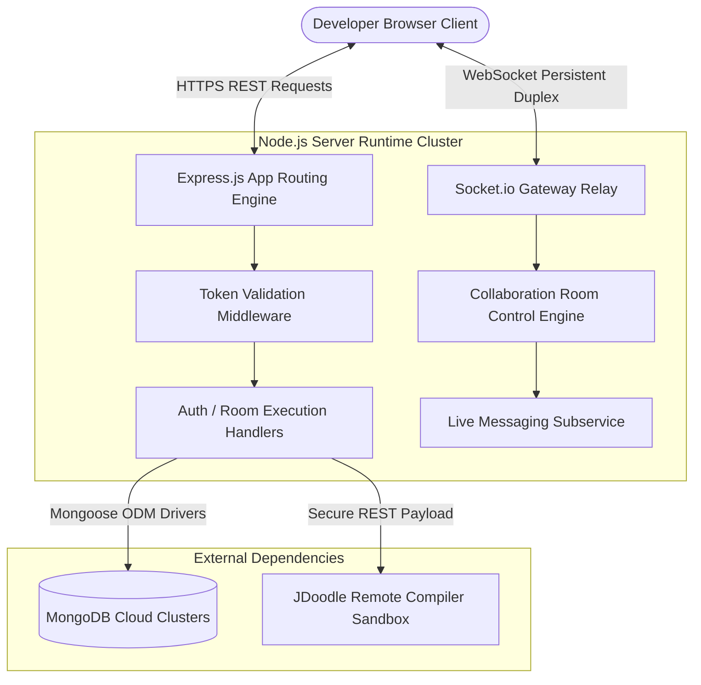
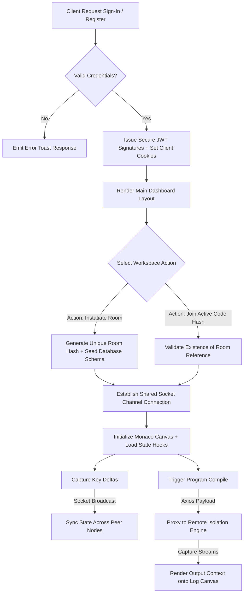

  CodeSync — Real-Time Collaborative Code Editor

⚡ Code Together. Collaborate Instantly. Build Smarter.

<p align="left">
  <a href="https://skillicons.dev">
    
  </a>
</p>

[](https://react.dev/)
[](https://nodejs.org/)
[](https://socket.io/)
[](https://www.mongodb.com/)
[](https://vitejs.dev/)

---

## 📌 Project Overview

**CodeSync** is an engineering-grade, full-stack real-time collaborative coding platform designed to eliminate the friction in remote programming workflows. Built as an advanced capstone during our professional technical training curriculum, the platform seamlessly combines multi-user live code editing with instant cross-language compilation, synchronized room-wide team chat, and session state awareness trackers.

Unlike standalone local text editors, CodeSync implements a highly responsive web-based IDE that coordinates live edits, manages multi-user connection synchronization states via dynamic operational tracking, and provides isolated compilation pipelines. It serves as a unified workspace optimized for high-velocity software engineering collaboration, hackathons, and remote technical evaluations.

### 🧠 Problem Statement
Modern distributed software engineering teams, academic peers, and hackathon squads struggle with structural lag and context-switching friction during remote synchronization sessions. Relying on screen-sharing software causes high network latency, single-user controls, and fragmented communication loops. CodeSync addresses this by establishing isolated, low-latency development workspaces that support multi-language code compilation alongside a highly synchronized developer-focused text canvas.

###  Real-World Use Cases
* **Pair Programming:** Distributed engineers can execute rapid agile refactoring loops in a shared environment without worrying about asynchronous git branch conflicts.
* **Technical Interview Assessments:** Enterprise technical recruiters can configure secure code evaluation rooms to monitor an applicant's analytical flow and problem-solving velocity in real-time.
* **Academic Labs & Coding Bootcamps:** Instructors can easily review student logic and diagnose operational compilation errors interactively across dozens of live student environments.

---

##  Table of Contents
1. [Project Overview](#-project-overview)
2. [Core Features](#-core-features)
3. [Tech Stack](#-tech-stack)
4. [System Architecture](#-system-architecture)
5. [Application Workflow](#-application-workflow)
6. [Folder Structure](#-folder-structure)
7. [Installation & Setup](#-installation--setup)
8. [Environment Variables](#-environment-variables)
9. [API Documentation](#-api-documentation)
10. [Major Modules & Implementations](#-major-modules--implementations)
11. [Database Schema & Models](#-database-schema--models)
12. [Authentication & Security](#-authentication--security)
13. [Performance Optimizations](#-performance-optimizations)
14. [Challenges & Solutions](#-challenges--solutions)
15. [Future Enhancements](#-future-enhancements)
16. [Team Details](#-team-details)
17. [Contribution Guidelines](#-contribution-guidelines)
18. [License](#-license)
19. [Acknowledgements](#-acknowledgements)

---

## ✨ Core Features

### 🔐 Authentication & Session Authorization
* **JSON Web Tokens (JWT):** Implements stateless authentication with tokens delivered via secure HTTP-Only cookies to protect against Cross-Site Scripting (XSS) vectors.
* **Cryptographic Salting:** User passwords undergo irreversible cryptographic multi-round hashing via `bcryptjs` before committing to the persistence layer.
* **Nodemailer Transports:** Integrates automated transactional mailing relays to securely handle forgotten password resets.

### 👨‍💻 Real-Time Synchronization Engine
* **Bi-Directional Sockets:** Utilizes a highly optimized `Socket.io` architecture to handle immediate delta-broadcasts for code modifications.
* **Dynamic Room Lifecycles:** Supports unique room token generation, password protection, state validation, and automatic cleanup hooks when users disconnect.
* **Interactive Presence Trackers:** Displays a real-time list of active room participants with visual active-state indicators.

### ⚙️ Full-Stack IDE Capabilities
* **Monaco Core Engine:** Integrated the enterprise-tier VS Code editing canvas supporting advanced syntax matching, error linting, and smart auto-formatting.
* **Multi-Language Compilation Matrix:** Interfaces with decoupled runtime compilers (including JavaScript, Python, C, C++, and Java) via secure execution proxies.
* **Isolated Input Handling:** Supports sending custom input streams (`stdin`) to target programs to evaluate dynamic computational logic.

### 💬 Integrated Team Communication
* **Instant Room Chat:** Built-in team messaging channels localized to individual room sessions, enabling real-time engineering design discussions alongside the code canvas.
* **Emoji Engine Integration:** Implements an interactive emoji picker interface (`emoji-picker-react`) to enrich text communications.
* **Asynchronous Alerts:** Uses reactive global toast triggers (`sonner`) to notify users dynamically when teammates join or vacate the room session.

---

## 🏗️ Tech Stack

### 🎨 Frontend Architecture

| Technology | Core Purpose | Implemented Scope |
| :--- | :--- | :--- |
| **React.js (v18)** | Component Declarations | Reactive UI state, component isolation, UI design system hooks. |
| **Monaco Editor** | Text Workspace Core | Multi-language syntax highlighting, line configurations, formatting rules. |
| **Zustand** | Global State Store | Non-boilerplate state management coordinating session data and theme states. |
| **Socket.io Client** | Event Streaming | Maintains long-lived bi-directional WebSocket connections to backend relays. |
| **Framer Motion** | Visual UX Animations | Micro-interactions, smooth panel slides, page transitions. |
| **Axios** | REST Client Transport | Configured instances with interceptor abstraction layers for backend API routing. |

### ⚙️ Backend & Infrastructure

| Technology | Core Purpose | Implemented Scope |
| :--- | :--- | :--- |
| **Node.js** | Server Runtime | JavaScript runtime executing asynchronous non-blocking event loops. |
| **Express.js** | HTTP Framework | Implements modular routing structures, security interceptors, and error handlers. |
| **Socket.io Server** | Gateway Event Router | Orchestrates real-time multi-client channel rooms and event emissions. |
| **MongoDB Atlas** | Database Layer | Fully managed cloud database storing user profiles and secure room states. |
| **Mongoose** | Object Data Modeling | Enforces rigid validation rules on the application's document schemas. |
| **JDoodle API** | Code Compilation | High-performance remote compilers running client-submitted source blocks. |

---

## 🧠 System Architecture



---

## 🔄 Application Workflow



---

## 📂 Folder Structure

```text
real-time-collaborative-code-editor/
│
├── Backend/
│   ├── config/
│   │   └── db.js                 # MongoDB connection instantiation file
│   ├── middleware/
│   │   └── verifyToken.js         # JWT validation check handler
│   ├── models/
│   │   ├── Room.js               # Structured data schema for active rooms
│   │   └── User.js               # Structured data schema for user security metrics
│   ├── routes/
│   │   ├── auth.js               # Routing endpoints for credentials management
│   │   ├── execute.js            # Code compilation network router
│   │   └── room.js               # Session metadata management routes
│   ├── services/
│   │   └── executorService.js    # Compilation API engine proxy abstraction
│   ├── socket/
│   │   └── socketHandler.js      # Main event orchestration for WebSockets
│   ├── utils/
│   │   ├── email.js              # SMTP connection configurations
│   │   └── generateRoomId.js     # Cryptographic session ID generation helper
│   ├── server.js                 # Central orchestration server entrypoint
│   └── package.json
│
├── Frontend/
│   ├── src/
│   │   ├── components/           # Reusable shared workspace UI components
│   │   ├── pages/                # High-level views (Login, Register, Editor Hub)
│   │   ├── services/             # Core API client communication modules
│   │   ├── store/                # Zustand global data store state hooks
│   │   ├── App.jsx               # Root application component routing
│   │   └── main.jsx              # DOM mounting and provider config context
│   └── package.json

```

---

## 🚀 Installation & Setup

### Prerequisites

* **Node.js** (v18.x or above) installed on your system.
* A running instance of **MongoDB** local server or a MongoDB Atlas cloud connection URI.
* A set of developer subscription credentials from the **JDoodle Compiler platform API**.

### Detailed Step-by-Step Deployment

1. **Clone the Repository**
```bash
git clone [https://github.com/your-username/real-time-collaborative-code-editor.git](https://github.com/your-username/real-time-collaborative-code-editor.git)
cd real-time-collaborative-code-editor

```


2. **Configure the Backend Layer**
```bash
cd Backend
npm install

```


Create a secure `.env` configuration file within the root of the `Backend/` directory:
```env
PORT=5000
MONGO_URI=mongodb+srv://<username>:<password>@cluster.mongodb.net/codesync
JWT_SECRET=super_cryptographic_secret_hash_key_phrase
CLIENT_URL=http://localhost:5173
JDOODLE_CLIENT_ID=your_actual_jdoodle_client_id
JDOODLE_CLIENT_SECRET=your_actual_jdoodle_client_secret
EMAIL_USER=your_smtp_relay_email@gmail.com
EMAIL_PASS=your_secure_app_password

```


Launch the backend developer execution profile:
```bash
npm run dev

```


3. **Configure the Frontend Layer**
```bash
cd ../Frontend
npm install

```


Launch the high-speed Vite local asset compilation server:
```bash
npm run dev

```


4. **Verification**
Open your browser and navigate to `http://localhost:5173` to access the live workspace dashboard.

---

## 📡 API Documentation

### 🔐 Authentication Module

| HTTP Method | Route String | Security Clearances | Functional Context |
| --- | --- | --- | --- |
| **POST** | `/api/auth/register` | Open Public Endpoint | Registers a new user into the database system. |
| **POST** | `/api/auth/login` | Open Public Endpoint | Validates credentials and returns an HTTP-only JWT cookie. |
| **POST** | `/api/auth/forgot-password` | Open Public Endpoint | Sends a temporary reset token via email. |

### 💻 Collaboration Room Module

| HTTP Method | Route String | Security Clearances | Functional Context |
| --- | --- | --- | --- |
| **POST** | `/api/room/create` | Bearer Token Verification Required | Generates and reserves a new room space hash. |
| **POST** | `/api/room/join` | Bearer Token Verification Required | Validates room access credentials. |
| **GET** | `/api/room/:id` | Bearer Token Verification Required | Returns code buffer histories and active user states. |

### ▶️ Isolation Engine Compiler Routing

| HTTP Method | Route String | Security Clearances | Functional Context |
| --- | --- | --- | --- |
| **POST** | `/api/execute` | Bearer Token Verification Required | Proxies raw code execution blocks to remote runtimes. |

---

## 🧩 Major Modules & Implementations

### 🔹 Socket Event Handlers (`socketHandler.js`)

This module manages incoming full-duplex persistent networking events. It handles critical real-time communication events:

* `room:join`: Attaches incoming client network streams to targeted room channels and updates presence trackers.
* `code:update`: Broadcasts character modifications instantly to other active clients in the room using efficient multi-cast relays.
* `chat:message`: Manages real-time message routing to ensure instant text synchronization within rooms.

### 🔹 Compilation Adapter Proxy (`executorService.js`)

This module handles communication with external compilation engines. It formats incoming source blocks into runtime payloads for target languages (such as Python, Java, or C++), validates input sizes, and cleanly returns execution logs or runtime errors to the workspace output console.

---

## 🗄️ Database Schema & Models

### 👤 User Schema Definition

```javascript
// User.js
const mongoose = require('mongoose');

const userSchema = new mongoose.Schema({
  username: { type: String, required: true, unique: true },
  email:    { type: String, required: true, unique: true },
  password: { type: String, required: true },
  createdAt:{ type: Date,   default: Date.now }
});

module.exports = mongoose.model('User', userSchema);

```

### 💻 Collaboration Room Schema Definition

```javascript
// Room.js
const mongoose = require('mongoose');

const roomSchema = new mongoose.Schema({
  roomId:         { type: String, required: true, unique: true },
  codeSnapshot:   { type: String, default: "" },
  activeLanguage: { type: String, default: "javascript" },
  roomPassword:   { type: String, default: null },
  participants:   [ { type: mongoose.Schema.Types.ObjectId, ref: 'User' } ],
  updatedAt:      { type: Date,   default: Date.now }
});

module.exports = mongoose.model('Room', roomSchema);

```

---

## 🛡️ Authentication & Security

CodeSync implements multiple layer guards designed to safeguard infrastructure components:

* **HttpOnly Cookie Enforcements:** JWT authorization cookies include specific configurations preventing manipulation from standard client scripts, eliminating standard Cross-Site Scripting (XSS) data capture vectors.
* **Encrypted Database Footprints:** Sensitive parameters are obfuscated using multi-stage bcrypt algorithms, ensuring user passwords cannot be recovered even if the primary server log storage is compromised.
* **Express Rate Limiting Guardrails:** Implements sliding request-window interception logic to mitigate brute-force authentication attacks on sensitive login endpoints.

---

## ⚡ Performance Optimizations

* **Socket Multi-Cast Segmentation:** Server nodes rely entirely on isolated room groups rather than global event broadcasting, preventing data lag as the number of active rooms scales up.
* **State Store Memoization via Zustand:** Replaced high-overhead global re-render routines with selective state subscription hooks to ensure smooth performance during heavy typing sessions.
* **Asynchronous Database Persistence:** Rather than triggering a database write for every single keystroke, code changes are bundled and saved asynchronously using optimized interval checkpoints to reduce server disk load.

---

## 🧠 Challenges & Solutions

* **Challenge 1: Race Conditions in Text Modification Synchronization.** When multiple developers typed simultaneously, conflicting editor updates caused text positioning to jump.
* *Solution:* Implemented debounce structures on the frontend and custom socket event acknowledgments. We optimized Monaco's internal delta-change listeners to intercept text mutations dynamically without causing editor cursor shifts.


* **Challenge 2: Execution Time Lag & Blocked Node Threads.** Interfacing with direct runtime execution engines synchronously threatened to lock or block server process loops.
* *Solution:* Designed an asynchronous proxy execution handler using a decoupled microservice structure via `executorService.js`, keeping the main Express server fast and fully responsive.


---

## 🚀 Future Enhancements

* **AI Code Assistant Layer:** Incorporate isolated local models or lightweight Generative LLM endpoints to provide collaborative real-time code autocomplete suggestions directly inside the workspace.
* **Operational Audio/Video Streaming:** Transition from pure chat interactions to full peer-to-peer WebRTC connections, enabling built-in voice and video channels within rooms.
* **Docker Isolation Sandbox:** Move from API execution proxies to isolated, local Docker containers to support robust runtime script hosting securely.

---

## 👨‍👩‍👨 Team Details

Developed as an advanced full-stack engineering project by **The Code Crafters**:

| Roll Number | Full Legal Name |
| --- | --- |
| **23EG105B52** | **Ritvik Sachin Tanna** |
| **23EG112C46** | **Sasanakota Vineel Krishna** |
| **23EG112D59** | **Yellayolla Swaragini** |
| **23EG105Q58** | **Mahesh Karnati** |
| **23EG112C07** | **CH. Rohith Sai** |

---

## 🤝 Contribution Guidelines

We welcome contributions from developers and open-source enthusiasts.

1. Fork the repository dashboard.
2. Create your isolated feature branch (`git checkout -b feature/AmazingFeature`).
3. Commit your modifications cleanly (`git commit -m 'Add some AmazingFeature'`).
4. Push your branch directly onto your remote fork (`git push origin feature/AmazingFeature`).
5. Open an official Pull Request detailing your design choices.

---

## 📜 License

This project is open-source software and is explicitly clear of corporate licensing constraints. You can package, fork, modify, or extend this infrastructure for school projects, portfolio evaluations, or open deployments.

```text
Copyright (c) 2026 CodeSync Open Source Initiative

Permission is hereby granted, free of charge, to any person obtaining a copy
of this software and associated documentation files (the "Software"), to deal
in the Software without restriction, including without limitation the rights
to use, copy, modify, merge, publish, distribute, sublicense, and/or sell
copies of the Software, and to permit persons to whom the Software is
furnished to do so, subject to the following conditions:

The above copyright notice and this permission notice shall be included in all
copies or substantial portions of the Software.

```

---

## 🙌 Acknowledgements

* The highly optimized web text engine layout created by the **Monaco Editor (VS Code)** community team.
* The ultra-responsive low-latency streaming infrastructure built by the **Socket.io** library maintainers.
* Our technical mentors and instructors throughout the **Suntek Training** curriculum.

---

## 📬 System Footnote

> **CodeSync** is actively maintained and continually optimized for developer productivity. For security disclosures, architectural questions, or feature requests, please submit an issue through the project's repository dashboard.

```text
⭐ If you find this workspace useful for your project showcases or remote interviews, don't forget to star the repository!

```

```

```
