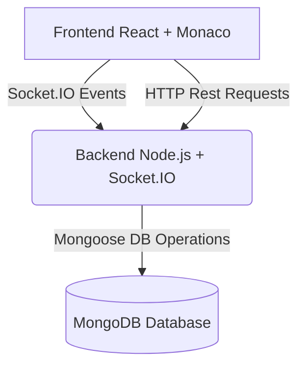

# Real-Time Collaborative Code Editor 🚀

A premium **Real-Time Collaborative Code Editor** built with React, Monaco Editor, Socket.IO, Express, and MongoDB, designed for seamless collaborative programming with a modern cyberpunk-inspired UI.

This platform enables developers to code together in real-time, chat instantly, execute code in multiple languages, and collaborate efficiently in secure rooms.

---

## ✨ Features

### 💻 Monaco Editor (VS Code Experience)
* **Powered by Monaco Editor**: The same industry-standard engine that drives Visual Studio Code.
* **Smart Editing**: Built-in syntax highlighting, auto-completion, code folding, and word wrap.
* **Multi-Language Support**: Seamless formatting and editing for multiple major languages.
* **Developer Typography**: Clean JetBrains Mono custom-spaced font.

### ⚡ Real-Time Collaboration
* **Instant Keystroke Sharing**: Real-time code synchronization across all users via Socket.IO.
* **Collaborative Indicators**: Live active cursors displaying each developer's username dynamically.
* **Optimized Persistence**: Debounced MongoDB writes (1-second delay) ensure high-frequency keystrokes compile smoothly without server lag.

### 💾 Multi-Language Code Preservation (Special feature! ⭐)
* **Code State Maps**: Saves and maps written code independently per language.
* **Instant Restorations**: Switching languages preserves your written scripts so you never lose your progress.
* **Zero Race Conditions**: Custom synchronous language refs prevent asynchronous React state rendering race conditions.
* **Intelligent fallback**: Loads customized starting boilerplate templates for JavaScript, Python, C, C++, Java, and Go.

### 🚀 Code Execution Engine
* **In-Browser Compiler**: Compile and execute code instantly with zero setup.
* **Live Sliding Console**: A slide-up, customizable execution panel.
* **Performance Insights**: Real-time analytics showcasing runtime duration (⏱) and memory footprints (💾).

### 💬 Real-Time Chat System
* **Instant Messaging**: Built-in messaging drawer for code discussions.
* **System Event Notifications**: Displays critical occurrences (joins/leaves) as centered cyberpunk pills without cluttering persistent logs.
* **Collaborative Toasts**: Routes temporary room updates (like language changes) directly to clean top-right popups.

### 🟢 Active Participants
* **Presence Tracking**: Displays glowing status lights indicating online users.
* **Synced Participant Sidebar**: Pure stateless updates driven by the parent component to resolve mounting lifecycle delays.

### 🔔 Premium Toast Notifications
* **Polished UX**: Beautifully styled animations powered by `sonner`.
* **Instant Feedback**: Notifies users of logins, logouts, room creations, successful joins, validation failures, code completion results, and collaborator actions.

### 🛡️ Secure Room Management
* **Dynamic Room Generator**: Custom 6-digit numeric IDs generated dynamically.
* **Password-Gateways**: Add optional passwords to rooms to keep your sessions secure.
* **Capacity Caps**: Set custom developer thresholds (e.g. maximum 5 participants).

### 🔐 Authentication & Security
* **Protected Routes**: Restricts workspace and dashboard access to authenticated users.
* **Refresh Recovery**: Keeps users securely logged in and reconnected to active rooms upon page refresh using JWTs and persistent Zustand hooks.

---

## 🛠️ Tech Stack

### Frontend
* **Core**: React.js
* **Editor**: @monaco-editor/react
* **Styling**: Vanilla CSS + Tailwind CSS
* **Animations**: Framer Motion
* **Real-time**: Socket.IO Client
* **Toasts**: Sonner
* **State Manager**: Zustand

### Backend
* **Server**: Node.js & Express.js
* **Real-time**: Socket.IO
* **Database**: MongoDB (Mongoose ODM)
* **Security**: JSON Web Tokens (JWT) & bcryptjs

---

## 🏗️ Project Architecture



---

## ⚙️ Installation

### 1. Clone the Repository
```bash
git clone https://github.com/Karnatimk007/Real-Time-Collaborative-Code-Editor.git
cd Real-Time-Collaborative-Code-Editor
```

### 2. Install Dependencies

#### Frontend
```bash
cd Frontend
npm install
```

#### Backend
```bash
cd ../Backend
npm install
```

---

## 🔑 Environment Variables

Create a `.env` file inside the `Backend` directory:

```env
PORT=5000
MONGO_URI=your_mongodb_connection_string
JWT_SECRET=your_secret_key
CLIENT_URL=http://localhost:5173
```

---

## ▶️ Running the Project

### Start the Backend
```bash
cd Backend
npm run dev
```

### Start the Frontend
```bash
cd Frontend
npm run dev
```

Your applications will open on:
* **Frontend**: [http://localhost:5173](http://localhost:5173)
* **Backend**: [http://localhost:5000](http://localhost:5000)

---

## 🧪 Key Functionalities Tested

* **[x] Real-time code sync**: Keystrokes are synchronized instantly.
* **[x] Collaborative editing**: Supports multi-user concurrent inputs and cursor tracking.
* **[x] Chat persistence**: Room history is maintained on refreshes.
* **[x] Multi-language code preservation**: Zero code loss when toggling programming languages.
* **[x] Room join/leave indicators**: Clean, automated system notifications.
* **[x] Secure credentials check**: Password validation and capacity limitations.
* **[x] Session recovery**: Refresh-safe login states using persistent Zustand modules.

---

## 🌟 Why This Project?

This project was built to provide a premium collaborative coding experience similar to:
* **Visual Studio Live Share**
* **Replit Multiplayer**
* **CodeSandbox Collaboration**

...while maintaining blazing-fast speed (⚡), modern dark aesthetics (🎨), and a secure room-based structure (🔐).

---

## 🚀 Future Improvements

* 🎙️ Voice & video group calls directly in the workspace.
* 🎨 Collaborative whiteboard sharing.
* 🤖 Integrated AI Coding Assistant.
* 📂 Dynamic project tree/file explorer.
* 🐙 Direct GitHub integration.
* 🛠️ Collaborative debugger.

---

## 🤝 Contributing

Contributions make the open-source community an amazing place to learn, inspire, and create.
1. Fork the Project.
2. Create your Feature Branch (`git checkout -b feature/AmazingFeature`).
3. Commit your Changes (`git commit -m 'Add some AmazingFeature'`).
4. Push to the Branch (`git push origin feature/AmazingFeature`).
5. Open a Pull Request.

---

## 📄 License

This project is licensed under the MIT License.

---

## 👨‍💻 Author

**Mahesh Karnati**
* GitHub: [@Karnatimk007](https://github.com/Karnatimk007)
